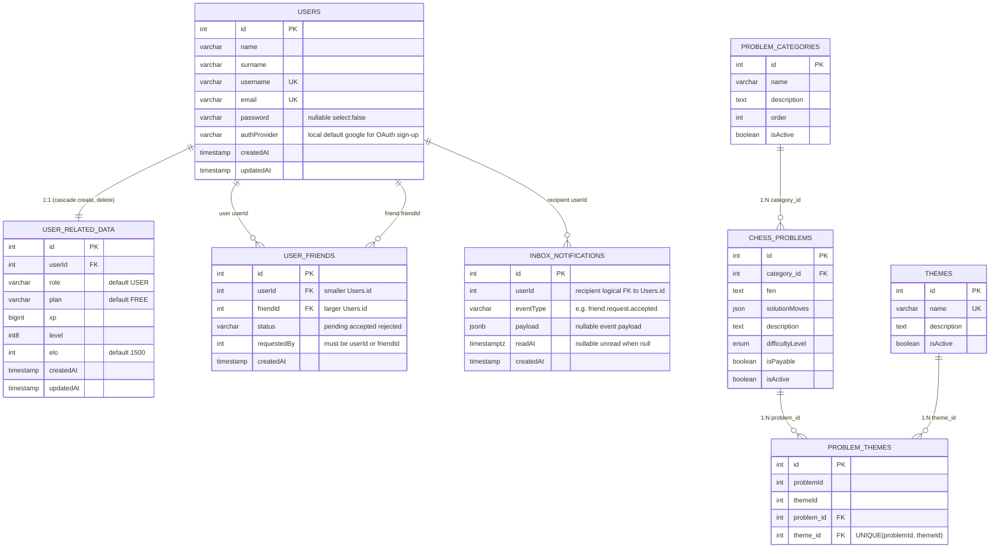
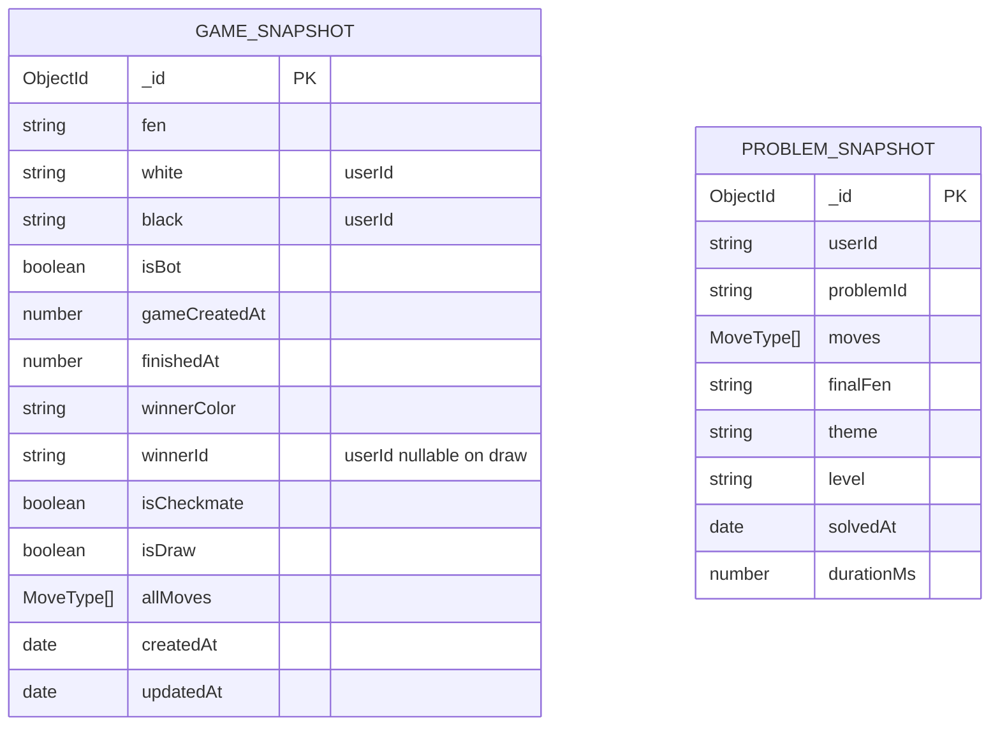
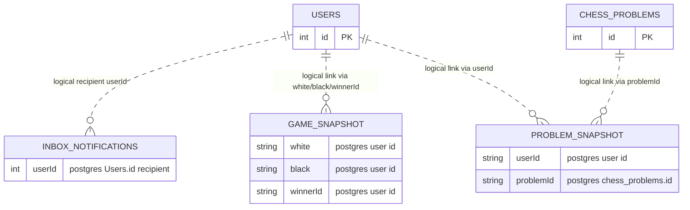

# Database ERDs

This document contains ERDs for:

1. PostgreSQL schema (including user inbox notifications for missed SSE)
2. MongoDB collections
3. Cross-database logical connections (user and snapshots approach)

Important: PostgreSQL and MongoDB have no physical foreign keys between them. Cross-database links are maintained by application logic and IDs stored as strings.

---

## 1) PostgreSQL ERD

### PostgreSQL Notes

- `Users.password` may be **null** for Google sign-up; `Users.authProvider` distinguishes `local` vs `google`.
- `Users` <-> `UserRelatedData` is modeled as one-to-one.
- `UserFriends`: one row per unordered pair; `userId` < `friendId` enforced by a check constraint; unique on `(userId, friendId)`; both FKs cascade on user delete.
- **`InboxNotifications`** (TypeORM entity `InboxNotification`, table `InboxNotifications`):
  - One row per **persisted notification** delivered to a **recipient** `userId` (same numeric id as `Users.id`; **no TypeORM `@ManyToOne` / DB FK** in the current entity—integrity is enforced in application code).
  - Used when the user may have been **offline** or **not connected to SSE**; complements live Redis → SSE delivery.
  - Columns: `eventType` (varchar 64), `payload` (jsonb, nullable), `readAt` (timestamptz, nullable = unread), `createdAt`.
  - Composite-style indexes: `(userId, readAt)`, `(userId, createdAt)` for inbox listing and unread queries.
  - **Not every SSE event is stored**: see `src/notification-service/notification-inbox-skip.constants.ts` (e.g. `friend.request.received` / `friend.request.sent` are skipped because `GET /user-service/friends/pending` is the source of truth for those).
  - HTTP API: `GET /notifications/inbox`, `PATCH /notifications/inbox/:id/read`, `POST /notifications/inbox/read-all` (see [Notification Service](./07-notification-service.md)).
- `chess_problems` belongs to one `problem_categories` row.
- Problem-theme is many-to-many through `problem_themes`.
- In code, `ProblemTheme` includes both scalar columns (`problemId`, `themeId`) and joined relation columns (`problem_id`, `theme_id`), so schema naming should be reviewed for consistency.

---

## 2) MongoDB ERD

### MongoDB Notes

- `GameSnapshot` has indexes on `white`, `black`, `finishedAt`, and `isBot+finishedAt`.
- `ProblemSnapshot` has an index on `userId` (for counts and user-scoped queries).
- `ProblemSnapshot` stores references as plain strings (`userId`, `problemId`), not Mongo ObjectId refs.
- PvP snapshot persistence is implemented.
- PvE snapshot persistence is implemented and flagged with `isBot: true`.

---

## 3) Overall Cross-Database Connection (Postgres <-> Mongo)

### Cross-Database Flow Notes

- **No database-level FK** exists between Postgres and Mongo.
- Linking is done in application services by copying IDs:
  - `GameSnapshot.white/black/winnerId` <- Postgres `Users.id` converted to string.
  - `ProblemSnapshot.userId` <- Postgres `Users.id` converted to string.
  - `ProblemSnapshot.problemId` <- Postgres `chess_problems.id` converted to string.
- **Within Postgres**, `InboxNotifications.userId` is also a **logical** reference to `Users.id` (same pattern: no FK constraint on the inbox table in the current schema).
- This is a denormalized event/history approach:
  - Postgres = operational source of truth (and **inbox rows** for notification replay after login).
  - Mongo = historical snapshots/analytics store.
- Because links are logical, integrity depends on service code (not FK constraints).

