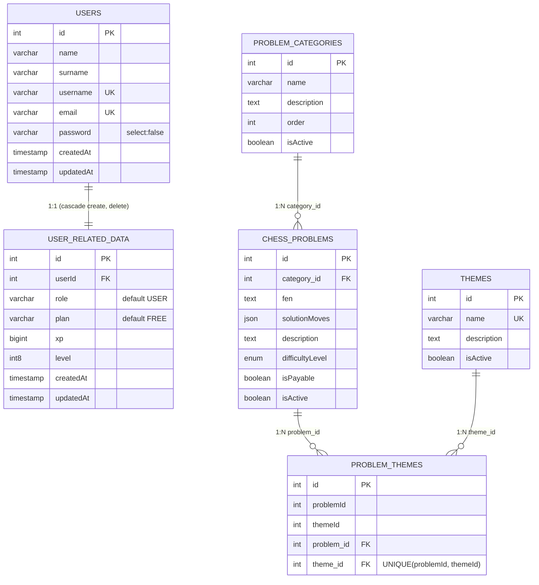
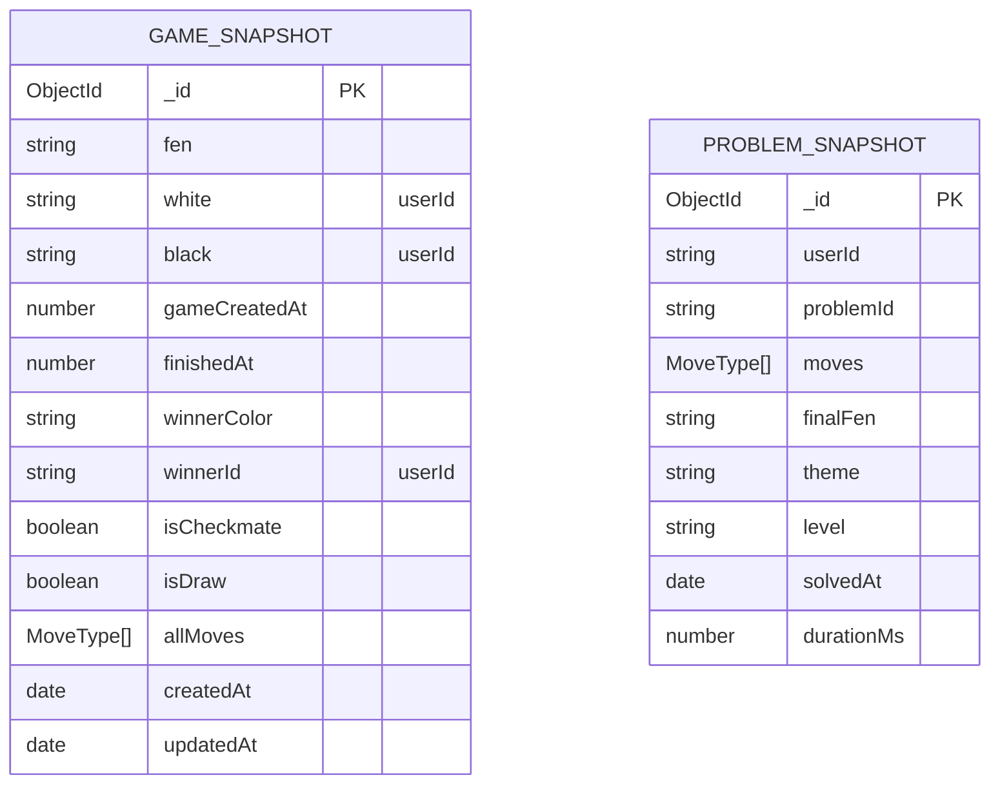
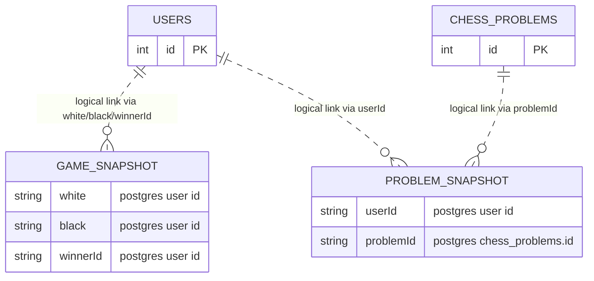

# Database ERDs

This document contains ERDs for:

1. PostgreSQL schema
2. MongoDB collections
3. Cross-database logical connections (user and snapshots approach)

Important: PostgreSQL and MongoDB have no physical foreign keys between them. Cross-database links are maintained by application logic and IDs stored as strings.

---

## 1) PostgreSQL ERD

### PostgreSQL Notes

- `Users` <-> `UserRelatedData` is modeled as one-to-one.
- `chess_problems` belongs to one `problem_categories` row.
- Problem-theme is many-to-many through `problem_themes`.
- In code, `ProblemTheme` includes both scalar columns (`problemId`, `themeId`) and joined relation columns (`problem_id`, `theme_id`), so schema naming should be reviewed for consistency.

---

## 2) MongoDB ERD

### MongoDB Notes

- `GameSnapshot` has indexes on `white`, `black`, `finishedAt`.
- `ProblemSnapshot` stores references as plain strings (`userId`, `problemId`), not Mongo ObjectId refs.
- PvP snapshot persistence is implemented.
- PvE snapshot persistence is currently not implemented in service logic (`storePvEGameResult` is stub).

---

## 3) Overall Cross-Database Connection (Postgres <-> Mongo)

### Cross-Database Flow Notes

- **No database-level FK** exists between Postgres and Mongo.
- Linking is done in application services by copying IDs:
  - `GameSnapshot.white/black/winnerId` <- Postgres `Users.id` converted to string.
  - `ProblemSnapshot.userId` <- Postgres `Users.id` converted to string.
  - `ProblemSnapshot.problemId` <- Postgres `chess_problems.id` converted to string.
- This is a denormalized event/history approach:
  - Postgres = operational source of truth.
  - Mongo = historical snapshots/analytics store.
- Because links are logical, integrity depends on service code (not FK constraints).

